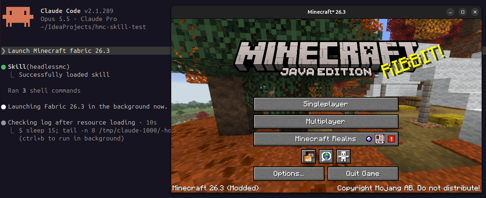

<!--suppress HtmlDeprecatedAttribute -->
<h1 align="center" style="font-weight: normal;"><b>HeadlessMc - Skill</b></h1>
<p align="center">A Claude Skill for
<a href="https://github.com/headlesshq/headlessmc">HeadlessMc</a>, a command line launcher
for Minecraft Java Edition.</p>
<p align="center"></p>

With this skill Claude can:

- help you install HeadlessMc on Linux, macOS, Windows, Docker or Android (Termux),
- launch the client, optionally headless (no GPU/display, e.g. in CI),
- install vanilla, Fabric, Forge and NeoForge versions,
- manage accounts, Java runtimes, profiles, and mods/resourcepacks/shaders/datapacks from Modrinth,
- set up and run Paper, Fabric, Purpur, Forge, NeoForge and vanilla servers,
- control a running client through the [hmc-specifics](https://github.com/headlesshq/hmc-specifics) mod,
- test mods in GitHub Actions with [MC-Runtime-Test](https://github.com/headlesshq/mc-runtime-test), including GameTests.

## Installation

### Claude Code

HeadlessMc is listed in Anthropic's plugin directory, so you can install it
with one command:

```sh
claude plugin install headlessmc@anthropic-plugin-directory
```

### Claude Code (this repository's marketplace)

```
/plugin marketplace add headlesshq/headlessmc-skill
/plugin install headlessmc@headlesshq
```

### Claude Code (manual)

Copy the skill folder into your personal skills directory:

```sh
git clone https://github.com/headlesshq/headlessmc-skill.git
mkdir -p ~/.claude/skills
cp -r headlessmc-skill/skills/headlessmc ~/.claude/skills/
```

To share it with everyone working on a project, copy it to `.claude/skills/`
in that project instead.

### Claude.ai and the Claude apps

1. Download or clone this repository.
2. Zip the skill folder so that `headlessmc/` is the top-level directory:
   ```sh
   cd headlessmc-skill/skills && zip -r headlessmc.zip headlessmc
   ```
3. Upload `headlessmc.zip` under **Settings → Capabilities → Skills**.

## Usage

The skill loads automatically when a request matches it, for example:

- "Launch Fabric 1.21.5 headless."
- "Set up a Paper 1.21.5 server with a few plugins."
- "Add a GitHub Actions workflow that tests my Fabric mod."

## Repository layout

```
.claude-plugin/
  marketplace.json        # marketplace listing this plugin
  plugin.json             # plugin manifest
skills/headlessmc/
  SKILL.md                # main skill instructions
  references/             # details loaded on demand
```

## Uninstallation

### Claude Code (Anthropic plugin directory)

```sh
claude plugin uninstall headlessmc@anthropic-plugin-directory
```

### Claude Code (this repository's marketplace)

Uninstall the plugin, then optionally remove the marketplace:

```
/plugin uninstall headlessmc@headlesshq
/plugin marketplace remove headlesshq
```

Removing the marketplace also uninstalls any plugins installed from it.

### Claude Code (manual)

Delete the skill folder from wherever you copied it:

```sh
rm -rf ~/.claude/skills/headlessmc
```

For a project install, delete `.claude/skills/headlessmc` in that project instead.

### Claude.ai and the Claude apps

Open **Settings → Capabilities → Skills** and delete the `headlessmc` skill.

## Account rules

HeadlessMc is not an official Minecraft product and does not let anyone play
without owning Minecraft. The skill only uses offline accounts for headless and
CI use cases.

## License

[MIT](LICENSE)
